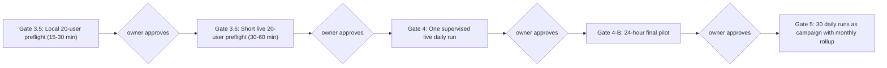
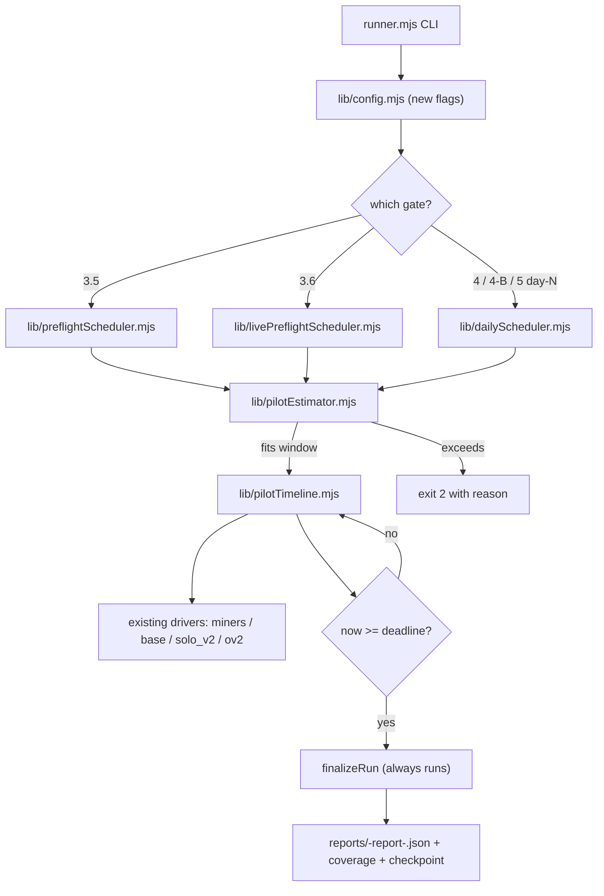

# MLEO QA Master Plan — Gates 3.5 → 5

## 0. End goal

20 persistent QA personas (`qa_ghost` … `qa_realtime_stress`) using the live MLEO site continuously, ideally as a controlled daily-automated campaign over 30 calendar days. Each day produces its own report. Owner can pause between days, review, fix, and continue. A 24-hour pilot is run only near the end, after the short and daily flows are proven. No long uncontrolled live runs.

## 1. Five-gate path overview



Every gate is owner-blocked. Implementation for any gate begins only after explicit written approval of this master plan plus a separate go-ahead per gate.

## 2. Persistent 20 users — how identity is preserved across all gates and days

The runner already builds a deterministic device id per persona via `qaDeviceId(personaId)` in [scripts/qa-monthly-sim/lib/deviceCookie.mjs](scripts/qa-monthly-sim/lib/deviceCookie.mjs). The same persona id maps to the same device cookie on every gate and every day. Server-side BASE / Miners / Solo / OV2 progression naturally accrues for each persona because the device cookie is stable.

What this gives us:
- Day 7 of the campaign sees the same `qa_base_ops` device that ran on day 1, with whatever buildings/research it earned in between.
- The `state.json` saved per persona by the OV2 driver (Playwright `storageState`) under `scripts/qa-monthly-sim/checkpoints/browser-state-<personaId>.json` survives between days and gates.
- Per-user history is queryable from `qa_sim_event` via `where user_id = '<persona id>'` regardless of which run/day produced the event.

What we will add for explicit campaign tracking (no schema migration):
- A campaign UUID is generated by the runner on Gate 4 day 1 and stored in `qa_sim_run.notes` as JSON `{ "campaignId": "<uuid>" }` for every day’s `qa_sim_run` row.
- Daily/monthly reporters group rows by that campaign id.

## 3. Why the previous Gate 4 attempt failed (and how every gate avoids it)

Old runner ([scripts/qa-monthly-sim/runner.mjs](scripts/qa-monthly-sim/runner.mjs)) executes personas with `for (const { persona } of schedules) { await runPersonaDay(...) }`. Combined with 15-45 min `gapMinutes` from [scripts/qa-monthly-sim/scheduler.mjs](scripts/qa-monthly-sim/scheduler.mjs), this produces:

- one user’s 24h schedule blocking every other user
- OV2 never reached if BASE user is first
- no deadline, no preflight estimator, no partial report

Every gate from 3.5 onward must use a single global interleaved timeline ordered by `scheduledAt`, with:
- a preflight estimator that refuses an over-budget plan before any DB write
- a hard deadline (`runStart + windowMs`) that is checked before every action
- a `try / finally` finalizer that always writes a partial or final report

Concretely all gates 3.5/3.6/4/4-B share the same orchestration core (`pilotTimeline.mjs` + `pilotEstimator.mjs` + a per-gate scheduler builder). Only the per-gate scheduler differs.

## 4. Hard rules across all gates

- No ENV / `.env` / `.gitignore` / security file changes.
- No UI / styling / design changes.
- No Legacy Arcade, Old Online, or old poker code touched.
- No cleanup script.
- No schema migrations beyond `migrations/qa/001_qa_sim_tables.sql` (already applied).
- No mocks in any gate that runs against the live site.
- No `--compressed` against `--mode=live` (already enforced by `assertLiveNotCompressed`).
- The monthly RNG scheduler in [scripts/qa-monthly-sim/scheduler.mjs](scripts/qa-monthly-sim/scheduler.mjs) `buildDaySchedule` is unchanged. New schedulers live in separate files. The only new thing the monthly path opts into is reading the existing `--force-active` flag (already implemented for Gate 3 validation only).
- Each gate has an explicit npm script. Default behavior of `node scripts/qa-monthly-sim/runner.mjs` without new flags is identical to today.

## 5. Common orchestration core (built once during Gate 3.5, reused by 3.6/4/4-B)



All schedulers emit the same shape: a sorted array `[{ scheduledAt, persona, module, action, params }, ...]`. The runner does not care which gate built the timeline.

## 6. Gate 3.5 — Local 20-user orchestration preflight

**Status:** ✅ **PASSED** — owner approved 2026-05-23. Run `3d756dcf-a083-4869-88e2-93a6b7ea5678` (`status: completed`, 20/20 users, 100 actions, ~2m39s local compressed). Report: `reports/preflight-report-3d756dcf-a083-4869-88e2-93a6b7ea5678.json`.

**Window:** 15–30 minutes (default 30).
**Mode:** `--mode=local --compressed`.
**Force active:** `--pilot-force-active` (separate from Gate 3 `--force-active`, which is local+compressed validation only).

**Files added:**
- [scripts/qa-monthly-sim/lib/preflightScheduler.mjs](scripts/qa-monthly-sim/lib/preflightScheduler.mjs)
- [scripts/qa-monthly-sim/lib/pilotEstimator.mjs](scripts/qa-monthly-sim/lib/pilotEstimator.mjs)
- [scripts/qa-monthly-sim/lib/pilotTimeline.mjs](scripts/qa-monthly-sim/lib/pilotTimeline.mjs)
- [scripts/qa-monthly-sim/preflight-collect.mjs](scripts/qa-monthly-sim/preflight-collect.mjs)
- [scripts/qa-monthly-sim/test/preflight-dryrun.test.mjs](scripts/qa-monthly-sim/test/preflight-dryrun.test.mjs)

**Files changed:**
- [scripts/qa-monthly-sim/lib/config.mjs](scripts/qa-monthly-sim/lib/config.mjs): add `--orchestration-preflight`, `--pilot-window-minutes`, `--pilot-force-active`, `--per-user-budget`.
- [scripts/qa-monthly-sim/runner.mjs](scripts/qa-monthly-sim/runner.mjs): early branch into preflight orchestrator with guard rules.
- [package.json](package.json): add `qa:orchestration-preflight`.

**Interleaving algorithm (used by 3.5, 3.6, 4, 4-B):** for each persona `i` in `[0..19]`, emit `perUserBudget` actions covering miners, base, solo_v2, ov2. Stagger user `i`'s first action by `i * staggerMs`. Same-user actions separated by `slotMs`. Sort merged array by `scheduledAt`. The first 20 entries are 20 different personas — proves OV2 cannot be blocked behind BASE.

**Estimator:** computes `users`, `totalActions`, `perModuleCounts`, `firstAt`, `lastAt`, `scheduleSpanMs`, `executionCostMs` (calibrated per module, OV2 dominates because of Playwright), `estimatedDurationMs = max(spanMs, costMs)`, `windowMs`, `fits`. Refuse with exit 2 and structured JSON if `!fits`.

**Hard-stop:** `deadline = Date.now() + windowMinutes * 60_000`. Checked before every action and every `await waitUntilScheduled`. SIGINT triggers same finalize path. Wrapped in `try / finally`.

**Pass criteria:**
- 20/20 users present in `qa_sim_event`
- All 4 modules touched
- `ov2.firstExecutedAt < base.lastExecutedAt`
- Run finished within window or `status: 'partial'` with clear timing
- `vault_mismatch` and `duplicate_reward` alert counts both 0

**Warning:** any persona with `executedActions = 0` despite `plannedActions > 0`.
**Fail:** runner.mjs exits non-zero before finalize, or report file not written.

**Exact command (Gate 3.5):**

```bash
npm run qa:orchestration-preflight
```

expanding to:

```bash
node scripts/qa-monthly-sim/runner.mjs --orchestration-preflight --all-users --mode=local --compressed --pilot-window-minutes=30 --pilot-force-active --per-user-budget=5
```

**Report:** `reports/preflight-report-<runId>.json` containing the 15-point owner report (run id, planned/executed/skipped/failed users, actions per user, modules per user, qa_sim_* counts, alert counts, coverage per module, timing, paths, confirmations).

## 7. Gate 3.6 — Short live 20-user preflight

**Status:** ✅ **PASSED** — implemented and run 2026-05-23. Run `a067a9ba-3745-4f87-ad8e-c5e0869ec66f` (`status: completed`, 20/20 users, 100 actions, ~35m live wall-clock, `https://mleo-m.vercel.app`). Report: `reports/live-preflight-report-a067a9ba-3745-4f87-ad8e-c5e0869ec66f.json`. **Gate 4 blocked** until owner explicitly approves.

**Runs only after Gate 3.5 passes and owner explicitly approves Gate 3.6.** *(satisfied)*

**Window:** 30–60 minutes (default 45).
**Mode:** `--mode=live` (no compressed). Real wall-clock waits.
**All 20 users:** included via `--all-users` plus `--pilot-force-active --approve-live-preflight`.

**Files added:**
- [scripts/qa-monthly-sim/lib/livePreflightScheduler.mjs](scripts/qa-monthly-sim/lib/livePreflightScheduler.mjs) — same interleave algorithm as 3.5 but with realistic per-action cadence calibrated to live HTTP latency and live OV2 Playwright cost.
- [scripts/qa-monthly-sim/live-preflight-collect.mjs](scripts/qa-monthly-sim/live-preflight-collect.mjs) — same shape as preflight-collect with extra checks: `cookieJar` reused per persona; `outsideWindow` count must be 0.

**Files changed:**
- [scripts/qa-monthly-sim/lib/config.mjs](scripts/qa-monthly-sim/lib/config.mjs): add `--live-preflight`, `--approve-live-preflight`, `--live-window-minutes`.
- [scripts/qa-monthly-sim/runner.mjs](scripts/qa-monthly-sim/runner.mjs): branch for `--live-preflight`; refuse without `--approve-live-preflight`.
- [package.json](package.json): add `qa:live-preflight`.

**Pass criteria:** same as 3.5 plus: 0 `runner_error` alerts, 0 `429` rate-limit errors that did not auto-recover via existing backoff in [scripts/qa-monthly-sim/lib/httpClient.mjs](scripts/qa-monthly-sim/lib/httpClient.mjs).

**Exact command:**

```bash
npm run qa:live-preflight
```

expanding to:

```bash
node scripts/qa-monthly-sim/runner.mjs --live-preflight --all-users --mode=live --live-window-minutes=45 --pilot-force-active --approve-live-preflight --per-user-budget=5
```

**Report:** `reports/live-preflight-report-<runId>.json`.

## 8. Gate 4 — Daily automation (one supervised live day)

**Status:** ✅ **IMPLEMENTED** — owner approved Gate 4 implementation 2026-05-23. **No live daily run started yet.** Awaiting owner approval of exact first-run command.

**Runs only after Gate 3.6 passes and owner explicitly approves Gate 4.** *(implementation approved; first live day pending)*

The Gate 4 model replaces the old "24h pilot" idea. Goal: one calendar day, all 20 users, interleaved, finished inside a defined daily window with a daily report. The owner runs one command per day. No auto-continuation.

**Daily window:** owner chooses per-run via `--daily-window-hours=N` (default 6). 6 hours is enough for 20 users × ~5 module actions each interleaved at realistic live cadence including OV2 Playwright. `--daily-window-hours=24` is allowed for the eventual Gate 4-B but blocked at Gate 4 unless `--approve-pilot-24h` is also given (see Gate 4-B).

**Files added:**
- [scripts/qa-monthly-sim/lib/dailyScheduler.mjs](scripts/qa-monthly-sim/lib/dailyScheduler.mjs) — interleaves 20 personas over the daily window, same global timeline contract as preflight, but with persona module weights respected and per-day variation seeded by `(seed, simDay)` so day 7 is different from day 1.
- [scripts/qa-monthly-sim/lib/dailyCheckpoint.mjs](scripts/qa-monthly-sim/lib/dailyCheckpoint.mjs) — writes `scripts/qa-monthly-sim/checkpoints/campaign-<campaignId>-day-<N>.json` with executed actions, deadline reached, per-user status.
- [scripts/qa-monthly-sim/daily-collect.mjs](scripts/qa-monthly-sim/daily-collect.mjs) — generates `reports/daily-report-<campaignId>-day-<N>.json`.
- [scripts/qa-monthly-sim/lib/campaignStore.mjs](scripts/qa-monthly-sim/lib/campaignStore.mjs) — manages campaign id in `qa_sim_run.notes` JSON; `getOrCreateCampaign(seed, label)`, `markDayCompleted`, `currentDay`, `lastCompletedDay`.

**Files changed:**
- [scripts/qa-monthly-sim/lib/config.mjs](scripts/qa-monthly-sim/lib/config.mjs): add `--daily`, `--day=<N>`, `--campaign-id=<uuid>`, `--daily-window-hours=<N>`, `--approve-day`.
- [scripts/qa-monthly-sim/runner.mjs](scripts/qa-monthly-sim/runner.mjs): branch for `--daily`; refuse without `--approve-day`; auto-resolve `--day` to `lastCompletedDay + 1` when omitted; refuse if previous day was not finalized.
- [package.json](package.json): add `qa:day` and `qa:day-status`.

**Owner workflow per day:**

```bash
# day 1 of new campaign
npm run qa:day -- --approve-day --daily-window-hours=6

# day 2 (uses same campaign id automatically)
npm run qa:day -- --approve-day

# inspect status without running
npm run qa:day-status -- --campaign-id=<uuid>
```

**Pause / resume contract:**
- Each daily run writes `qa_sim_run.status = 'completed' | 'partial' | 'aborted'` plus `notes.dayNumber`.
- Next day refuses to start if previous day’s status is `running` (means a process is still alive). Owner can force-recover with `--reset-day=<N>` after manual inspection.
- Owner can stop between days indefinitely; campaign resumes by simply running `npm run qa:day -- --approve-day` again on any later calendar date.

**Per-user history inspection:**

```bash
node scripts/qa-monthly-sim/inspect-user.mjs --campaign-id=<uuid> --user-id=qa_base_ops [--day=N]
```

returns per-day net delta, vault end, error count, last action, top game, and a link to that day’s coverage artifact. Implementation reads `qa_sim_event` and `qa_sim_daily_summary` tables.

**Pass criteria for one Gate 4 day:**
- 20/20 users present
- 4/4 modules touched
- Daily report file written
- Daily checkpoint written
- `vault_mismatch` = 0
- `duplicate_reward` = 0
- `runner_error` = 0 OR all explained in report
- `outsideWindow` = 0

**Exact commands:**

```bash
npm run qa:day -- --approve-day --daily-window-hours=6        # day 1 (or auto-resume)
npm run qa:day -- --day=3 --approve-day                        # explicit day 3 of same campaign
npm run qa:day-status -- --campaign-id=<uuid>                  # readonly status
```

**Report:** `reports/daily-report-<campaignId>-day-<N>.json` plus `reports/daily-report-<campaignId>-day-<N>.html`.

## 9. Gate 4-B — 24-hour final pilot

**Runs only after Gate 4 daily model is owner-approved on at least one supervised day.**

Single 24-hour Gate 4-style run. All 20 users (or owner-approved subset). Real wall-clock. No mocks. No compressed. Hard 24h stop. Same `pilotTimeline` core, but the scheduler builder uses `dailyScheduler.mjs` with `--daily-window-hours=24`.

**Files changed:** none beyond config flag additions:
- [scripts/qa-monthly-sim/lib/config.mjs](scripts/qa-monthly-sim/lib/config.mjs): add `--approve-pilot-24h`, allow `--daily-window-hours=24` only with this flag.
- [scripts/qa-monthly-sim/runner.mjs](scripts/qa-monthly-sim/runner.mjs): treat 24h as a single Gate-4 day with extended window.
- [package.json](package.json): add `qa:pilot-24h`.

**Exact command:**

```bash
npm run qa:pilot-24h -- --approve-day --approve-pilot-24h
```

expanding to:

```bash
node scripts/qa-monthly-sim/runner.mjs --daily --all-users --mode=live --daily-window-hours=24 --pilot-force-active --approve-day --approve-pilot-24h
```

**Pass criteria:** same as Gate 4 day, plus runtime within 24h ± 5 min.
**Report:** `reports/pilot-24h-report-<runId>.json`.

## 10. Gate 5 — 30 daily runs as a campaign + monthly rollup

**Runs only after Gate 4-B is owner-approved.**

Owner-preferred mode: 30 supervised daily runs (one per calendar day, paused between days). Continuous auto mode is allowed only with `--approve-full-run --auto-continue` (explicitly opt-in). Default = supervised.

**Files added:**
- [scripts/qa-monthly-sim/monthly-rollup.mjs](scripts/qa-monthly-sim/monthly-rollup.mjs) — joins all `qa_sim_run` rows for the campaign id, aggregates per-user totals, errors, top game, vault drift; writes `reports/monthly-final-<campaignId>.html` and `.json`.

**Files changed:**
- [package.json](package.json): add `qa:campaign-status`, `qa:monthly-rollup`, `qa:run-supervised`.

**Owner workflow (supervised):**

```bash
npm run qa:day -- --approve-day             # repeat daily, owner inspects between
npm run qa:campaign-status                  # readonly progress
npm run qa:monthly-rollup -- --campaign-id=<uuid>   # only after 30 days complete
```

**Owner workflow (continuous, opt-in only):**

```bash
npm run qa:run-supervised -- --approve-full-run --auto-continue --max-days=30
```

`qa:run-supervised` simply loops `qa:day` once per UTC day, refusing to start a new day until `now >= previousDayStart + 24h`. Each day still produces an independent report. Owner can `Ctrl-C` between days. No pauses inside a day.

**Pass criteria for Gate 5:**
- 30 daily reports exist for the campaign
- monthly rollup written
- aggregate `vault_mismatch` and `duplicate_reward` across the campaign both 0
- per-user campaign stats available

**Reports:**
- `reports/daily-report-<campaignId>-day-<N>.json` × 30
- `reports/monthly-final-<campaignId>.json` and `.html`

## 11. Owner approval gates (summary)

| Gate | Trigger flag/script | Owner approval requirement | Result |
|------|---------------------|----------------------------|--------|
| 3.5 | `npm run qa:orchestration-preflight` | This master plan approved | ✅ PASSED — run `3d756dcf-…5678`, owner approved Gate 3.6 |
| 3.6 | `npm run qa:live-preflight` | Gate 3.5 report reviewed and explicitly approved | ✅ PASSED — run `a067a9ba-…c66f`; owner approved Gate 4 implementation |
| 4 (one day) | `npm run qa:day -- --approve-day` | Gate 3.6 report reviewed and explicitly approved | ✅ implemented — **awaiting owner approval for first live day run** |
| 4-B (24h) | `npm run qa:pilot-24h -- --approve-day --approve-pilot-24h` | One Gate 4 day report reviewed and explicitly approved | ⏳ blocked |
| 5 supervised | `npm run qa:day` × 30 | Gate 4-B report reviewed and explicitly approved | ⏳ blocked |
| 5 continuous | `npm run qa:run-supervised -- --approve-full-run --auto-continue` | Same plus explicit continuous opt-in | ⏳ blocked |

The runner refuses every gate without its required approval flag.

## 12. Reports per gate (what each produces)

| Gate | JSON | HTML | Coverage artifact | Checkpoint |
|------|------|------|-------------------|------------|
| 3.5 | `reports/preflight-report-<runId>.json` | none | `reports/coverage-<runId>-day1.json` | `scripts/qa-monthly-sim/checkpoints/run-<runId>-day-1.json` |
| 3.6 | `reports/live-preflight-report-<runId>.json` | optional via `qa:report` | same shape as 3.5 | same shape as 3.5 |
| 4 day-N | `reports/daily-report-<campaignId>-day-<N>.json` | `reports/daily-report-<campaignId>-day-<N>.html` | `reports/coverage-<runId>-day<N>.json` | `scripts/qa-monthly-sim/checkpoints/campaign-<campaignId>-day-<N>.json` |
| 4-B | `reports/pilot-24h-report-<runId>.json` | optional | per-day coverage | same |
| 5 monthly | `reports/monthly-final-<campaignId>.json` + 30 daily reports | `reports/monthly-final-<campaignId>.html` | union of 30 coverage files | union of 30 checkpoints |

Every report contains: run id, campaign id, mode, window, started/ended/runtime, per-user table (planned/executed/skipped/failed), per-module counts, `qa_sim_*` row counts, alert breakdown, top earner, worst loss, most profitable game, repeated error buckets, stuck sessions, orphan rooms (Gate 3.6 onward), timing samples, paths.

## 13. Pass / warning / fail definitions (uniform across gates)

**Pass:**
- 20/20 users present in events for the gate (or N/N for 4-B subset if owner-approved)
- 4/4 modules touched
- 0 `vault_mismatch`
- 0 `duplicate_reward`
- 0 `runner_error` OR all explained
- runner finalized cleanly (`status: 'completed'` or `'partial'` with documented reason)

**Warning:**
- any persona with `plannedActions > 0` and `executedActions = 0`
- non-zero `outsideWindow` count
- `coverage_gap > 0` for module/action that was supposed to run

**Fail:**
- runner crashed before finalize
- report file not written
- `vault_mismatch > 0` or `duplicate_reward > 0`
- monthly RNG scheduler regressed (Gate 3.5/3.6 snapshot test fails)

## 14. Anti-regression — what stays the same in monthly scheduler

[scripts/qa-monthly-sim/scheduler.mjs](scripts/qa-monthly-sim/scheduler.mjs) `buildDaySchedule` and `buildSchedulesForDay` are untouched. Anything that imports them today (existing `--all-users` monthly path, existing `qa:dry-run`, `qa:validate`) keeps producing byte-identical output.

A snapshot test in `scripts/qa-monthly-sim/test/preflight-dryrun.test.mjs` will lock the monthly schedule for `seed=42, day=1, allUsers=true, compressed=true` and fail the build if it ever changes. This is the regression guard.

The new schedulers (`preflightScheduler`, `livePreflightScheduler`, `dailyScheduler`) do not call `buildDaySchedule`. They are independent.

## 15. What is explicitly blocked at each gate

- Gate 3.5: blocks `--mode=live`, `--approve-pilot`, `--approve-full-run`, `--all-users` without `--orchestration-preflight`.
- Gate 3.6: blocks `--compressed`, `--mock`, missing `--approve-live-preflight`.
- Gate 4: blocks any day-N without `--approve-day`; blocks `--daily-window-hours > 12` without `--approve-pilot-24h`; blocks starting day-N if day-(N-1) status is `running`.
- Gate 4-B: blocks without `--approve-day` AND `--approve-pilot-24h`.
- Gate 5 supervised: blocks day-N without `--approve-day`.
- Gate 5 continuous: blocks without `--approve-full-run --auto-continue --max-days=<N>`.
- All gates: block `--mock` when `--mode=live`.
- All gates: block writing to anything outside `reports/`, `scripts/qa-monthly-sim/checkpoints/`, and `qa_sim_*` tables.

## 16. After this master plan is approved — order of work

1. ~~Implement Gate 3.5 only~~ ✅ done
2. ~~Run `npm run qa:orchestration-preflight` against `localhost:3000`~~ ✅ run `3d756dcf-a083-4869-88e2-93a6b7ea5678`
3. ~~Return the 15-point Gate 3.5 owner report~~ ✅ owner approved → Gate 3.6
4. ~~Implement and run Gate 3.6 live preflight~~ ✅ run `a067a9ba-3745-4f87-ad8e-c5e0869ec66f`
5. ~~Owner approves Gate 4 implementation~~ ✅ approved 2026-05-23
6. ~~Implement Gate 4 daily automation (no live run)~~ ✅ done
7. **Current stop point:** owner approves exact first `npm run qa:day` command before any live daily run.

Gate 4 / 4-B / 5 entries in this plan remain the agreed contract for when each becomes the next approved step.

## 17. Confirmation — what is NOT happening as a result of this plan

- No live run.
- No 24-hour run.
- No 30-day run.
- No cleanup script.
- No ENV / `.env` / `.gitignore` / security file changes.
- No UI / styling / design changes.
- No Legacy Arcade / Old Online / old poker code touched.
- No DB migrations.
- No code edits at all until owner explicitly approves THIS master plan.
