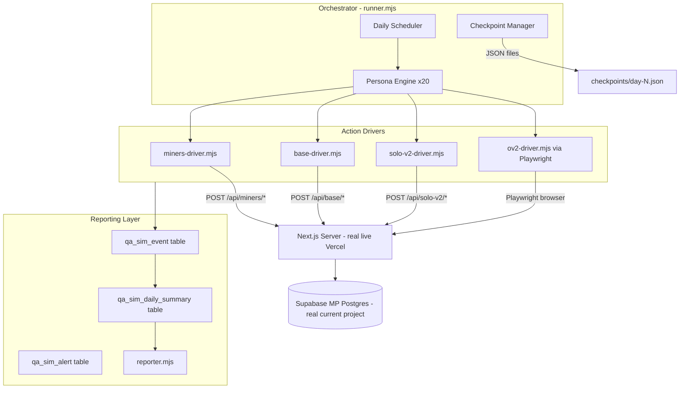

# Monthly Real User Behavior Simulator — Full Technical Plan

---

## HARD RULES (Agent must read before doing anything)

The following constraints are set by the owner and must never be overridden by an agent, an automation, or an assumption. They apply at every phase.

### Do not implement yet

This plan is in approval state. No files may be created, modified, or deleted. No scripts may be run. No migrations may be applied. No simulations may be started. Implementation begins only after the owner explicitly approves this plan (Gate 2).

### No ENV / .env / .gitignore work — ever

- Do NOT touch `.env.local`.
- Do NOT touch `.env*` files.
- Do NOT inspect git history for secrets.
- Do NOT modify `.gitignore`.
- Do NOT add security cleanup steps.
- Do NOT add security hardening.
- Do NOT add extra security layers of any kind.
- Security cleanup is explicitly out of scope by owner decision.
- If any future agent step touches these items, it must stop and ask the owner.

### Real current environment — no separate project

- The simulator must run against the current real live site.
- Same current Vercel/live deployment.
- Same current Supabase MP project.
- Same real API/server routes.
- Same real vault/economy/session behavior.
- Do NOT create a separate Supabase project.
- Do NOT create a separate Vercel deployment.
- Do NOT create a separate QA environment.
- The site is in development with no public real users. This is why the real environment is safe to use for this QA run.

### No mocks in the main/live run

- The live monthly run must hit real API routes, real database, real vault, real session flows.
- Mock mode (`--mock`) may exist only for internal local diagnostic purposes and dry-runs.
- Mock mode must never be used during Phase 4, Phase 5, or any live pilot.

### Full 30-day run = real wall-clock distributed behavior

- The full 30-day run is not a compressed batch.
- It is not a smoke test.
- It is not a fake or ping simulator.
- It must behave like real users spread across real calendar days, distributed throughout each day.
- Compressed time is allowed only in: `--dry-run`, `--mode=local` short validation, Phase 3 controlled test.
- The full live run command must not use compressed time by default.

### Allowed modules — hard list

The simulator may test ONLY these four modules:

**A. Miners**
- Route: `/play`
- Real Miners state, accrue, gifts, claim-to-vault, server sync where applicable

**B. MLEO BASE**
- Route: `/mleo-base`
- Real BASE state, all available actions, progression, ship-to-vault, missions, contracts, research, modules, crew, maintenance, expeditions where applicable

**C. New Arcade / Solo V2 only**
- Only games from the current `lib/solo-v2/registry.js` (all 27 live games)
- Real session creation, game play, and reward/vault behavior

**D. Online V2 / OV2 only**
- Route: `/online-v2/rooms`
- Only OV2 active games from `lib/online-v2/onlineV2GameRegistry.js`
- Real shared-room flows, Realtime, seats, start match, leave, settlement where applicable

### Hard excluded — never test, never modify, never route QA users there

- Legacy Arcade (all routes under `pages/crash.js`, `pages/plinko.js`, `pages/bomb.js`, `pages/local-arcade/*`)
- Old Online (`games-online/` — `BingoMP.js`, `PokerMP.js`, `LudoMP.js`, etc.)
- Old Poker (`pages/poker/*`, `pages/api/poker/*`)
- Legacy `21-challenge.js` (non-OV2)
- Any unrelated old game routes
- Any product UI / design / styling changes
- Any ENV / security / gitignore cleanup

### AUTO agent constraints

- AUTO may begin implementation only after the owner explicitly approves the final written plan (Gate 2).
- If AUTO hits uncertainty around DB schema, Realtime behavior, vault accounting, or destructive cleanup operations, it must stop and ask the owner instead of guessing.
- AUTO must not skip owner approval gates.

---

## Owner Approval Gates

All five gates require explicit owner approval before proceeding. No gate is auto-triggered.

**Gate 1 — Plan approval (current step)**
- Owner reads and approves this written plan.
- No implementation of any kind until approved.
- Revisions requested? Return revised plan and re-enter Gate 1.

**Gate 2 — Implementation approval**
- After Gate 1 is approved, implementation may begin.
- Implementation includes: QA sim tables migration, `scripts/qa-monthly-sim/` skeleton, all drivers, scheduler, checkpoint system, report generator.
- Implementation must NOT run a 24h or 30-day live simulation.
- Implementation must NOT run migrations on production DB without explicit confirmation.

**Gate 3 — Short validation approval**
- After implementation is complete, a short controlled local validation run may execute.
- Scope: 2 QA users (`qa_ghost` + `qa_miner_core`), 1 simulated day, `--mode=local`.
- Results (events in DB, vault before/after, checkpoint integrity) must be returned to owner.
- Owner reviews results before Gate 4 opens.

**Gate 4 — 24-hour pilot approval**
- After Gate 3 results reviewed and approved by owner.
- 5 QA users, 1 real calendar day, against real live environment.
- Owner reviews pilot report before Gate 5 opens.

**Gate 5 — 30-day run approval**
- After Gate 4 pilot reviewed and approved by owner.
- All 20 QA users, 30 real calendar days, real wall-clock distributed behavior.
- Starts only with explicit owner instruction.

---

## 1. Current Code Audit

### Router
- **Next.js Pages Router** (no App Router). All routes under `pages/`, all APIs under `pages/api/`.

### Miners (`/play` → `pages/play.js`)
- Game module: `game/mleo-miners.js`
- API entry points: `pages/api/miners/state.js`, `accrue.js`, `claim/to-vault.js`, `claim/to-wallet.js`, `gift/claim.js`
- Identity: cookie-based arcade device via `pages/api/arcade/device.js`
- Vault: `pages/api/arcade/vault/balance.js`, `credit.js`, `claim.js`

### MLEO BASE (`/mleo-base` → `pages/mleo-base.js` → `game/mleo-base.js`)
- Action API: `pages/api/base/` — 20+ action handlers (`build`, `research`, `ship`, `expedition`, `crew`, `module`, `maintenance`, `mission-claim`, `contract-claim`, `command-protocol`, `sector-deploy`, `spend`, `profile`, `unlock-support-program`, etc.)
- State API: `pages/api/base/state.js`, `presence.js`
- Vault API: `pages/api/base/vault/balance.js`, `apply.js` (apply currently blocks direct calls from `mleo-base` source — the block gate must be reviewed before driving BASE vault flows)
- Economy authority: `styles/sql/base_server_authority.sql`, `base_atomic_rpc.sql`

### Solo V2 (`pages/[game].js` for each route in registry)
- Registry: `lib/solo-v2/registry.js` — **27 live games**
- Session API: `pages/api/solo-v2/sessions/create.js`, `[sessionId].js`, `[sessionId]/event.js`
- Resolve API: one `resolve.js` per game under `pages/api/solo-v2/[game-key]/`
- Vault delta: `vault-delta.js` for `quick-flip`, `echo-sequence`, `pulse-lock`, `safe-zone` (others use resolve-only)
- Session schema: `supabase/migrations/20260327130000_solo_v2_00_foundation.sql`

### Online V2 (`/online-v2/rooms` → `pages/online-v2/rooms.js`)
- Hub: `pages/online-v2.js`
- Room API: `pages/api/ov2-wave/private-create.js`, `private-verify.js`, `private-sweep-cron.js`
- Game operators: `pages/api/ov2-c21/operate.js`, `ov2-color-wheel/operate.js`, `ov2-community-cards/operate.js`
- Registry: `lib/online-v2/onlineV2GameRegistry.js` — 17+ active shared product IDs
- Realtime: `hooks/useOv2*Session.js`, `lib/online-v2/*/Ov2*SessionAdapter.js`
- Settlement: `lib/online-v2/ov2SettlementVaultDelivery.js`

### Existing scripts reusable
- `scripts/ov2-browser-qa.mjs` — Playwright OV2 room + Ludo + Rummy flow (extend directly)
- `scripts/ov2-final-verify.mjs` — forfeit, mobile regression (reference patterns)
- `scripts/ov2-rummy-final-verify.mjs` — Rummy E2E (reference)
- `sim/economy/profiles.ts` — 4 behavior profiles (casual, normal, aggressive, offline-heavy) — reference only for action rate calibration

### Missing infrastructure
- No QA user persistence mechanism (device IDs / localStorage states per user)
- No simulation orchestrator / scheduler
- No DB-backed reporting tables
- No checkpoint/resume system
- No anomaly/alert detection layer
- No daily/monthly report generator

---

## 2. Proposed Architecture



### Runner / Orchestrator (`scripts/qa-monthly-sim/runner.mjs`)
- Main entry point; reads `--day N`, `--resume`, `--dry-run`, `--compressed` flags
- Loads all 20 persona configs
- Determines which users are active today (per consistency pattern + seeded RNG)
- For each active user: creates a `PersonaSession`, schedules actions distributed across the day's real time windows
- After each simulated day: writes checkpoint, triggers daily report generation

### Per-User Persona Engine (`scripts/qa-monthly-sim/personas.mjs`)
- Exports 20 `PersonaConfig` objects (defined in Section 4)
- Each persona has: `id`, `dailyActiveMinutes` range, `activeDaysPerMonth`, `moduleWeights` (miners/base/soloV2/ov2), `riskLevel`, `sessionStyle`, `seed`
- Seeded PRNG (`mulberry32` or similar) so runs are reproducible given same seed

### Action Scheduler (`scripts/qa-monthly-sim/scheduler.mjs`)
- Given a persona and a calendar day, produces an ordered list of `ScheduledAction` objects with `wallClockTime`, `module`, `action`, `params`
- Actions are spread across real time windows throughout the day (morning / afternoon / evening)
- Pacing: adds realistic inter-action delays per persona (casual = 60–300s gaps; heavy = 5–30s gaps)
- Rate-limit guard: minimum 2s between API calls per user; randomized jitter applied

### Browser/Session Handling
- Miners + BASE + most Solo V2: **pure HTTP** via `fetch` with `Cookie` header (no browser needed), using the arcade device cookie pattern from `pages/api/arcade/device.js`
- OV2 and Solo V2 games requiring UI interaction: **Playwright** headless Chromium, extending `ctxUser()` pattern from `ov2-browser-qa.mjs`
- Each QA user has a dedicated Playwright browser context with persistent `storageState` saved to `checkpoints/browser-state-{userId}.json`
- Device IDs: deterministic per user via `crypto.createHash('sha256').update('qa-' + userId + '-v1')`

### Server/DB Reporting Layer
- All events written to `qa_sim_event` table via `getSupabaseAdmin()` (same admin client used by the app)
- All QA reporting tables prefixed `qa_sim_` to stay separate from product tables
- Daily cron-style aggregation SQL populates `qa_sim_daily_summary` and `qa_sim_economy_snapshot`
- Alerts written to `qa_sim_alert` when thresholds exceeded
- Owner access: via Supabase dashboard (direct table access) or a `scripts/qa-monthly-sim/reporter.mjs` command that generates HTML/JSON reports

### Live Mode vs Local/Dev Mode

| Flag | Target | Allowed in full run? |
|------|--------|---------------------|
| `--mode=live` | Real current Vercel/live site | Yes — default for all live runs |
| `--mode=local` | `http://localhost:3000` | Yes — for local dev/validation only |
| `--compressed` | Speeds up time between actions | Only allowed in `--mode=local` / dry-run / Phase 3 |
| `--dry-run` | Prints schedule, no real calls | Yes — safe at any time |
| `--mock` | Mocks vault/API responses | Local diagnostic only — never in live run |

---

## 3. Data Model / Reporting Model

### New Supabase tables (migration: `migrations/qa/001_qa_sim_tables.sql`)

All tables created in the **current Supabase MP project** — no separate project.

**`qa_sim_run`** — one row per simulation run
- `id uuid pk`, `run_label text`, `started_at timestamptz`, `ended_at timestamptz`, `mode text`, `seed int`, `month_number int`, `status text`, `notes text`

**`qa_sim_event`** — one row per atomic action
- `id uuid pk`, `run_id uuid fk`, `user_id text` (e.g. `qa_ghost`), `simulated_at timestamptz`, `recorded_at timestamptz`, `module text` (miners/base/solo_v2/ov2), `action text`, `game_key text nullable`, `session_id text nullable`, `vault_before bigint`, `vault_after bigint`, `delta bigint`, `outcome text` (win/loss/error/timeout/stuck), `error_message text`, `response_ms int`, `raw_response jsonb`

**`qa_sim_session`** — one row per game session
- `id uuid pk`, `run_id uuid fk`, `user_id text`, `module text`, `game_key text`, `started_at timestamptz`, `ended_at timestamptz`, `duration_ms int`, `actions_count int`, `vault_start bigint`, `vault_end bigint`, `net_delta bigint`, `outcome text`, `error_count int`, `stuck boolean`

**`qa_sim_daily_summary`** — rolled-up per user per day
- `id uuid pk`, `run_id uuid fk`, `user_id text`, `sim_day int`, `date date`, `total_active_ms int`, `session_count int`, `miners_sessions int`, `base_sessions int`, `solo_v2_sessions int`, `ov2_sessions int`, `total_earned bigint`, `total_spent bigint`, `net_delta bigint`, `vault_end bigint`, `error_count int`, `stuck_count int`, `top_game_key text`

**`qa_sim_economy_snapshot`** — vault balance checkpoints per user per day
- `id uuid pk`, `run_id uuid fk`, `user_id text`, `sim_day int`, `snapshot_time timestamptz`, `vault_balance bigint`, `total_earned_cumulative bigint`, `total_spent_cumulative bigint`

**`qa_sim_alert`** — anomaly / warning / fail events
- `id uuid pk`, `run_id uuid fk`, `user_id text nullable`, `sim_day int`, `alert_type text` (suspicious_gain / duplicate_reward / stuck_session / orphaned_room / vault_mismatch / economy_breach / realtime_disconnect), `severity text` (info / warning / fail), `details jsonb`, `created_at timestamptz`

### QA data in real product tables

Because the simulation runs against the real current environment, QA users will create real product-level records:
- real device records (arcade device cookies)
- real vault records
- real `solo_v2_sessions` rows
- real BASE state rows
- real OV2 room/member/session rows
- real Miners state rows

This is intentional. The simulation is testing real server behavior. All QA-generated product data must be **clearly traceable** via:
- QA device IDs starting with `qa-` prefix (e.g. `qa-ghost-v1-abcdef`)
- QA display names starting with `[QA]` prefix in OV2 lobby
- `qa_sim_event` cross-references linking each QA action to its product record
- `run_id` and `user_id` present in every QA reporting table row
- Deterministic device ID generation so any product record can be traced back to a specific persona

### Owner report access

The owner can inspect all 20 QA users via:
1. Supabase dashboard — direct query of `qa_sim_*` tables
2. `node scripts/qa-monthly-sim/reporter.mjs --run-id=<id>` — generates HTML report
3. `node scripts/qa-monthly-sim/reporter.mjs --run-id=<id> --user=qa_ghost` — per-user detail

**The owner must be able to see for each of the 20 users:**
- Each user's daily activity timeline
- Modules played and games played
- Time played per day
- Vault balance before and after each day
- Total earned / spent / lost per day and cumulative
- Sessions created (count, duration, outcome)
- Errors encountered
- Stuck sessions
- Economy anomalies
- Suspicious reward events
- Top earner across all users
- Worst loss across all users
- Most profitable game
- Most broken game
- Realtime/room lifecycle issues
- Exact per-user action timeline per day

---

## 4. The 20 QA User Personas

| # | ID | Display Name | Daily Minutes | Active Days/Mo | Modules | Risk | Testing Focus |
|---|----|----|----|----|----|----|-----|
| 1 | qa_ghost | [QA] Ghost | 0–10 | 5–8 | Any (random) | None | Near-absent user: does server state expire/corrupt across long gaps? |
| 2 | qa_drifter | [QA] Drifter | 10–30 | 14–18 | Miners 60%, BASE 40% | Low | Light casual; baseline economy producer |
| 3 | qa_miner_core | [QA] Miner Core | 60–120 | 25–28 | Miners 90%, BASE 10% | Low | Miners-focused economy over 30 days; claim-to-vault timing |
| 4 | qa_base_ops | [QA] Base Ops | 90–180 | 24–28 | BASE 90%, Miners 10% | Low | BASE build/research/expedition/ship cycle; vault apply behavior |
| 5 | qa_solo_safe | [QA] Solo Safe | 45–90 | 20–24 | Solo V2 100% | Low | Conservative Solo V2; low-stake games; expected-value drift |
| 6 | qa_solo_risky | [QA] Solo Risky | 60–120 | 20–24 | Solo V2 100% | High | Aggressive Solo V2; jackpot-chasing; abnormal gain detection |
| 7 | qa_ov2_social | [QA] OV2 Social | 60–120 | 22–26 | OV2 100% | Medium | Room create/join/leave lifecycle; Realtime stability |
| 8 | qa_balanced | [QA] Balanced | 60–150 | 22–26 | All 4 equal | Medium | Balanced cross-module user; economy interaction across systems |
| 9 | qa_daily_grind | [QA] Daily Grind | 120–240 | 27–30 | Miners 40%, Solo V2 40%, BASE 20% | Medium | Consistent medium user; daily cap behavior; vault accumulation |
| 10 | qa_heavy_miner | [QA] Heavy Miner | 240–360 | 26–30 | Miners 80%, BASE 20% | Medium | Heavy Miners grinder; tests daily/total cap enforcement |
| 11 | qa_econ_tester | [QA] Econ Tester | 120–240 | 24–28 | Solo V2 50%, BASE 30%, Miners 20% | High | Rapid repeated actions; duplicate reward attempts; vault race conditions |
| 12 | qa_max_player | [QA] Max Player | 360–480 | 28–30 | All 4, heavy Solo V2 + OV2 | High | Max usage 6–8h/day; server rate limits; Supabase connection limits; cap enforcement |
| 13 | qa_skip_days | [QA] Skip Days | 90–180 | 10–14 | Miners 50%, BASE 50% | Low | Skips most days; does server state persist across 5+ day gaps? |
| 14 | qa_burst | [QA] Burst | 180–300 in one burst | 12–16 | Solo V2 60%, OV2 40% | High | Concentrated burst sessions; then offline for days |
| 15 | qa_switcher | [QA] Switcher | 90–180 | 20–24 | Rotates all 4 mid-session | Medium | Module-switching within single login; context/state isolation |
| 16 | qa_long_session | [QA] Long Session | 180–300 continuous | 18–22 | OV2 60%, Solo V2 40% | Medium | Very long single sessions; memory leaks; Realtime disconnect/reconnect |
| 17 | qa_base_researcher | [QA] Base Researcher | 90–180 | 24–28 | BASE 100% | Low | Deep BASE progression: research tiers, expeditions, contracts, crew, protocols |
| 18 | qa_cashout_early | [QA] Cashout Early | 45–90 | 20–24 | Solo V2 100% | Medium | Cashout-early pattern (surge_cashout, echo-sequence, pulse-lock); partial-session vault delivery |
| 19 | qa_room_creator | [QA] Room Creator | 60–120 | 22–26 | OV2 100% | Medium | Creates rooms; tests private/public/hidden lifecycle; orphaned room detection |
| 20 | qa_realtime_stress | [QA] RT Stress | 120–240 | 24–28 | OV2 80%, Solo V2 20% | High | Rapid connect/disconnect; Realtime channel stability; stale room detection |

**Key persona notes:**

- **qa_ghost** (1): Acts only on randomly chosen days (5–8 of 30). Sessions are 1–2 actions (e.g., open Miners, do not claim). Designed to reveal whether server state persists across 5–20 day gaps.
- **qa_econ_tester** (11): Issues rapid back-to-back POST to resolve APIs, attempts to call vault-delta twice for the same session, submits duplicate event IDs, fires consecutive BASE `ship` actions faster than normally allowed. Results logged as alerts if rewards are doubled.
- **qa_max_player** (12): 6–8 hours/day. Cycles through all four modules. Saturates the system closest to real-world heavy usage. Also tests daily/total economy caps.
- **qa_realtime_stress** (20): Joins OV2 room, deliberately drops connection (`page.reload()`), reconnects, attempts rejoin, and verifies room state is consistent. Tests the `useOv2DebouncedReload` pattern.

---

## 5. Simulation Schedule

### Month-Long Run Structure

```
Day 0:    Dry-run + infra validation (local only, no real API calls)
Day 1–30: One real calendar day per simulated day; orchestrator wakes every 5 minutes
Day 31:   Final report generation
```

### Real-Day Behavior — Not Compressed

The full 30-day run distributes each persona's activity across real wall-clock time, throughout each day:

- **Morning window** (08:00–12:00 local): casual / drifter / grind users more active
- **Afternoon window** (13:00–17:00 local): BASE / Miners-focused users more active
- **Evening window** (18:00–23:00 local): OV2 social / burst users more active
- **Burst users**: all activity crammed into 1 randomly chosen 3-hour window per active day
- **Ghost**: may not activate at all; if active, a single very short window

Actions within each window are paced with persona-specific delays (not zero-delay batch execution).

### Compressed mode (local/dry-run only)

`--compressed` flag collapses real-time delays to accelerated delays for local development and Phase 3 validation. Must not be used in Phase 4 or Phase 5.

### Pause/Resume Strategy
- Checkpoint written at end of each real calendar day: `checkpoints/run-{runId}-day-{N}.json`
  - Contains: `runId`, `day`, `timestamp`, `perUserVaultBalance`, `perUserSessionCount`, `perUserLastAction`, `browserStateFiles[]`
- Resume: `node scripts/qa-monthly-sim/runner.mjs --resume --run-id=<id>` reads last checkpoint and picks up from the next day
- Playwright browser contexts saved to `checkpoints/browser-state-{userId}.json` between days
- If a browser context crashes mid-day: error logged to `qa_sim_alert`; user marked as `recovered`; new context launched from last saved state

### Max Daily Duration Enforcement
- Scheduler hard-caps each user at their `maxDailyMinutes`:
  - `qa_max_player`: 480 min
  - `qa_heavy_miner`: 360 min
  - All others: per persona config (see Section 4)
- Actions are paced using `await sleep(delay_ms)` with persona-specific inter-action delay ranges

---

## 6. Game Coverage Plan

### Miners Coverage (`miners-driver.mjs`)
- `GET /api/miners/state` — read current state
- `POST /api/miners/accrue` — simulate mining breaks
- `POST /api/miners/claim/to-vault` — vault transfer
- `POST /api/miners/gift/claim` — test gift flows
- `GET /api/arcade/vault/balance` — vault read before/after
- Test: idle accumulation, active upgrade path, claim timing, multiple claims per day

### BASE Coverage (`base-driver.mjs`)
- `GET /api/base/state` — read full state
- Actions to drive: `build`, `research`, `module`, `crew`, `expedition`, `maintenance`, `ship` (vault transfer), `mission-claim`, `contract-claim`, `command-protocol`, `sector-deploy`, `profile`, `spend`, `unlock-support-program`
- Test: full build → research → expedition → ship cycle; maintenance timing; crew assignment; multi-sector unlock; strategy/protocol changes
- Note: `api/base/vault/apply.js` currently blocks `mleo-base` source directly — the block gate must be read before implementation to confirm which path BASE vault delivery uses

### Solo V2 Coverage (`solo-v2-driver.mjs`)
- All 27 live games from `lib/solo-v2/registry.js` must be exercised at least once during the 30-day run
- Each session: `POST /api/solo-v2/sessions/create` → play events → `POST /api/solo-v2/[game]/resolve` → optional vault-delta
- Games distributed by risk profile: conservative users play `odd_even`, `quick_flip`, `dice_pick`; aggressive users play `surge_cashout`, `solo_ladder`, `core_balance`, `relic_draft`
- Test: session creation, normal resolution, cashout-early path, vault delta delivery, double-resolve rejection

### OV2 Coverage (`ov2-driver.mjs`, extending `ov2-browser-qa.mjs`)
- Create public / private / hidden rooms
- Join by room code
- Test all currently active shared product IDs from `ONLINE_V2_ACTIVE_SHARED_PRODUCT_IDS`
- Priority games for extended testing: Ludo, Rummy 51, Bingo, Checkers, Backgammon (existing QA patterns in `ov2-browser-qa.mjs`)
- Room lifecycle: create → join → seat → start match → play → settle → leave
- Stake flow: stake commit, forfeit payout
- Realtime: monitor channel stability across sessions

### Hard Excluded (never tested, never modified, never routed to)
- `pages/crash.js`, `pages/plinko.js`, `pages/bomb.js`, `pages/local-arcade/*` — legacy arcade
- `games-online/` (`BingoMP.js`, `PokerMP.js`, etc.) — old online
- `pages/poker/*`, `pages/api/poker/*` — old poker
- `pages/21-challenge.js` (legacy) — old arcade game

---

## 7. Economy Validation Plan

### Metrics to Calculate

Per user, per day, and cumulative over 30 days:
- Total MLEO earned (by module)
- Total MLEO spent (by module)
- Net delta
- Vault balance start/end per day
- Session count by module
- Win rate by game key
- Average reward per session by game key
- Expected Value (EV) per game key vs theoretical EV from config

### Expected Value Checks
- For each Solo V2 game: compare actual average net delta vs expected EV from `lib/solo-v2/[game]Config.js`
- Alert if actual EV deviates more than ±20% from config EV over 50+ sessions
- For OV2: compare stakes-in vs settlement-out per game type

### Abnormal Gain/Loss Detection
- **Single-session gain threshold**: alert if any session produces >5× expected max reward for that game
- **Daily gain threshold**: alert if any user earns >3× the theoretical daily max for their activity level
- **Loss floor**: alert if any user loses >90% of vault in a single day without corresponding session evidence

### Duplicate Reward Detection
- Log `session_id` for every resolve call
- Cross-reference in `qa_sim_event`: if same `session_id` appears in two separate `vault_after` credits, flag as `duplicate_reward` alert (severity: FAIL)

### Vault Consistency Checks
- After each session: record `vault_before + delta` = expected `vault_after`
- Read actual vault balance from `GET /api/arcade/vault/balance`
- If `|actual - expected| > 0`: flag as `vault_mismatch` alert

### Economy Breaker Alerts
- If any user's cumulative 30-day net earn exceeds 10× the theoretical max for their profile: FAIL
- If any game's aggregate RTP across all users deviates >25% from config: WARNING
- If vault total across all 20 users grows without bound (no softcap enforcement): FAIL

---

## 8. Technical Risks

| Risk | Mitigation |
|------|-----------|
| Playwright stability over 30 days | Save/restore browser contexts per day; restart browser on crash; 3 retries per action |
| Supabase connection limits | Use admin client for reporting only; game drivers use anon/cookie-based client; max 5 concurrent Playwright contexts |
| Realtime channel accumulation | Explicitly unsubscribe channels after each OV2 session; monitor `qa_sim_alert` for stale channels |
| Stale OV2 rooms | After each real-day: trigger `ov2-wave/private-sweep-cron` equivalent to clean QA rooms; log orphaned rooms as alerts |
| Device identity across days | Playwright `storageState` preserved in checkpoint files; deterministic device-ID generation |
| QA vault balances accumulating in real DB | Expected behavior — QA runs against real environment. Document accumulated balances in final report. Post-run cleanup script available but runs only with explicit owner approval. |
| BASE `vault/apply.js` block | Apply route blocks `mleo-base` source; BASE vault delivery goes via `api/base/ship.js`. Review gate before building BASE driver. |
| Long-run memory leaks | Node.js process recycled per simulated day; Playwright browser launched fresh each day |
| Vercel serverless timeout (10s) | Drivers must handle 504 responses gracefully; retry with exponential backoff |
| Rate limiting (Upstash Redis) | Pacing enforced at persona level; minimum 2s between API calls per user; randomized jitter |

---

## 9. Phased Implementation Plan

### Phase 0 — Audit (Complete — this plan)
- Identify all routes, API endpoints, existing scripts
- Map vault/economy flows
- No code changes

### Phase 1 — Infrastructure + Schema (begins after Gate 2)
- Create `migrations/qa/001_qa_sim_tables.sql` (all 6 QA reporting tables)
- Apply migration to current Supabase MP project (owner confirms before applying)
- Create `scripts/qa-monthly-sim/` directory skeleton
- Create `scripts/qa-monthly-sim/personas.mjs` with all 20 persona configs
- Create base `checkpoint.mjs`, `reporter.mjs` stubs
- Validate that admin client can write to `qa_sim_event`
- Add npm scripts to `package.json`: `qa:dry-run`, `qa:pilot`, `qa:run`, `qa:report`, `qa:cleanup`

### Phase 2 — Persona Engine + Drivers (begins after Gate 2)
- Implement `scheduler.mjs` and `runner.mjs` core loop (with `--dry-run` and `--mode=local` support)
- Implement `miners-driver.mjs` (HTTP only, no browser)
- Implement `base-driver.mjs` (HTTP only, no browser)
- Implement `solo-v2-driver.mjs` (HTTP only for most games)
- Implement `ov2-driver.mjs` (Playwright, extending patterns from `ov2-browser-qa.mjs`)
- Implement `economy-validator.mjs` (EV checks, alert writing, vault consistency)
- Implement `reporter.mjs` (daily + monthly HTML/JSON report)
- Implement `cleanup.mjs` (dry-run by default — see Section 10)

### Phase 3 — Short Controlled Validation (begins after Gate 3)
- 2 QA users (`qa_ghost` + `qa_miner_core`), 1 simulated day, `--mode=local`, `--compressed`
- Verify: events written to DB, vault before/after captured, checkpoint saved, no errors
- Return results to owner for review

### Phase 4 — 24-Hour Pilot (begins after Gate 4)
- 5 QA users: `qa_ghost`, `qa_miner_core`, `qa_base_ops`, `qa_solo_safe`, `qa_ov2_social`
- `--mode=live` against the current real live site
- Real wall-clock time — no compression
- Verify daily report generated; owner reviews before Gate 5

### Phase 5 — Full 30-Day Run (begins after Gate 5)
- All 20 QA users, real wall-clock distributed behavior across 30 calendar days
- `--mode=live` against the current real live site
- Monitor `qa_sim_alert` table daily
- Weekly interim reports at days 7, 14, 21, 30

### Phase 6 — Final Report + Owner Review
- Generate `reports/monthly-final-report.html`
- Owner reviews via Supabase dashboard and HTML report
- Cleanup script run optionally and only with explicit owner approval
- Lessons fed back into economy model and game configs

---

## 10. Cleanup Strategy

Cleanup is a tool, not an automatic step.

Rules:
- `cleanup.mjs` defaults to `--dry-run` (preview only, no deletions)
- Real deletion/reset requires passing `--confirm` flag explicitly
- Cleanup must never delete non-QA data
- Cleanup is optional and runs only after final owner review
- Cleanup must not be triggered automatically by the runner or reporter

Cleanup can:
- Delete rows from `qa_sim_*` tables for a given `run_id`
- Reset vault balances for QA device IDs (only if explicitly requested)
- Remove orphaned OV2 rooms created by QA personas

Cleanup must not:
- Touch product tables unrelated to QA device IDs
- Run without `--confirm`
- Run automatically at any point

---

## 11. Acceptance Criteria

### Before 30-Day Run (Gate 4 pilot must pass):
- [ ] All 20 personas can be instantiated without errors
- [ ] Miners driver: state read, accrue, claim all return 200 with expected vault delta
- [ ] BASE driver: state read + at least 3 action types succeed end-to-end
- [ ] Solo V2 driver: session create + resolve succeeds for at least 5 different game keys
- [ ] OV2 driver: room create + join + start match + leave for Ludo succeeds
- [ ] `qa_sim_event` rows written for all of the above
- [ ] Checkpoint written and resume from checkpoint produces correct state
- [ ] `vault_mismatch` alert count = 0 in pilot run
- [ ] `duplicate_reward` alert count = 0 in pilot run
- [ ] All QA-generated product data is clearly traceable to the 20 QA users/personas and can be separated in reports

### Pass/Warning/Fail Thresholds for 30-Day Run:

| Metric | Pass | Warning | Fail |
|--------|------|---------|------|
| EV deviation per game | < ±10% | ±10–25% | > ±25% |
| Vault mismatch events | 0 | 1–2 (investigation) | ≥ 3 |
| Duplicate reward events | 0 | — | ≥ 1 |
| Stuck sessions (no resolution after 10 min) | ≤ 2 total | 3–5 | ≥ 6 |
| Orphaned OV2 rooms at run end | 0 | 1–2 | ≥ 3 |
| Realtime disconnect events | ≤ 5/day avg | 6–15/day | > 15/day |
| Economy breaker (10× theoretical max) | None triggered | — | Any triggered |
| Daily report generation | All 30 days | 28–29 days | < 28 days |

### Required Evidence at End of Run:
- `qa_sim_daily_summary`: 30 rows × 20 users = 600 rows
- `qa_sim_economy_snapshot`: ≥ 600 rows
- `reports/monthly-final-report.html` or equivalent
- `qa_sim_alert` table fully populated and reviewed
- Owner can answer all target questions: which user earned most, which game gave too much MLEO, which game caused errors, which game was played most, did all 4 modules contribute fairly, did any user break the economy, did any user get stuck, did any server state disappear, did any room remain orphaned, did any action duplicate rewards, did the economy remain reasonable after 30 days

---

## 12. Files to Add / Change

### New files (Phase 1 + 2)

- `scripts/qa-monthly-sim/runner.mjs` — main orchestrator, CLI entry point with gates
- `scripts/qa-monthly-sim/personas.mjs` — 20 persona config objects with seeded PRNG params
- `scripts/qa-monthly-sim/scheduler.mjs` — per-persona daily action schedule generator; distributes across day windows; real wall-clock pacing by default
- `scripts/qa-monthly-sim/checkpoint.mjs` — write/read/resume checkpoint JSON
- `scripts/qa-monthly-sim/economy-validator.mjs` — EV checks, alert writing, vault consistency
- `scripts/qa-monthly-sim/reporter.mjs` — daily + monthly HTML/JSON report generator; owner-readable
- `scripts/qa-monthly-sim/drivers/miners-driver.mjs` — HTTP driver for Miners API
- `scripts/qa-monthly-sim/drivers/base-driver.mjs` — HTTP driver for BASE API
- `scripts/qa-monthly-sim/drivers/solo-v2-driver.mjs` — HTTP driver for Solo V2 session/resolve API
- `scripts/qa-monthly-sim/drivers/ov2-driver.mjs` — Playwright driver for OV2; extends `ov2-browser-qa.mjs` patterns
- `scripts/qa-monthly-sim/cleanup.mjs` — post-run QA data cleanup; dry-run default; never auto-runs
- `migrations/qa/001_qa_sim_tables.sql` — all 6 QA reporting tables with indexes
- `scripts/qa-monthly-sim/README.md` — owner guide for running, reading reports, and cleanup

### Files to modify

- `package.json` — add scripts: `qa:dry-run`, `qa:pilot`, `qa:run`, `qa:report`, `qa:cleanup`

### Files to reference (not modify)

- `scripts/ov2-browser-qa.mjs` — reuse `ctxUser()`, `lobby()`, `submitCreate()`, `joinCodeModal()` patterns
- `sim/economy/profiles.ts` — reference for per-module action rate calibration
- `lib/solo-v2/registry.js` — game key list for Solo V2 driver
- `lib/online-v2/onlineV2GameRegistry.js` — active OV2 game IDs

---

## 13. Proposed Commands

### Dry-run (no server calls, validates schedule generation):
```bash
node scripts/qa-monthly-sim/runner.mjs --dry-run --day 1
```

### Local validation (2 users, 1 compressed day, local server — Phase 3):
```bash
npx next dev -p 3000 &
node scripts/qa-monthly-sim/runner.mjs --users qa_ghost,qa_miner_core --day 1 --mode=local --compressed
```

### 24-hour live pilot (5 users, real time, real live site — Phase 4, Gate 4 only):
```bash
node scripts/qa-monthly-sim/runner.mjs \
  --users qa_ghost,qa_miner_core,qa_base_ops,qa_solo_safe,qa_ov2_social \
  --day 1 --mode=live
```

### Full 30-day run (all 20 users, real wall-clock, real live site — Phase 5, Gate 5 only):
```bash
node scripts/qa-monthly-sim/runner.mjs --all-users --month 1 --mode=live
```

### Resume after interruption:
```bash
node scripts/qa-monthly-sim/runner.mjs --resume --run-id=<uuid> --mode=live
```

### Generate daily report:
```bash
node scripts/qa-monthly-sim/reporter.mjs --run-id=<uuid> --day 14 --output=reports/day14.html
```

### Generate final monthly report:
```bash
node scripts/qa-monthly-sim/reporter.mjs --run-id=<uuid> --final --output=reports/monthly-final-report.html
```

### View alerts via Supabase:
```bash
npx supabase db query "SELECT * FROM qa_sim_alert WHERE run_id='<uuid>' AND severity='fail' ORDER BY created_at DESC"
```

### Cleanup — dry-run preview (always run this first):
```bash
node scripts/qa-monthly-sim/cleanup.mjs --run-id=<uuid> --dry-run
```

### Cleanup — real execution (explicit owner approval required):
```bash
node scripts/qa-monthly-sim/cleanup.mjs --run-id=<uuid> --confirm
```
