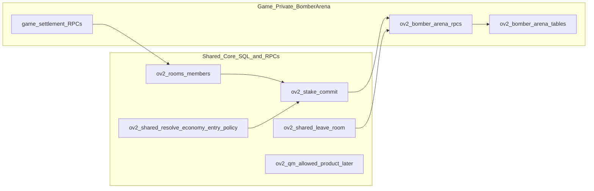

# OV2 Bomber Arena — approval-only architecture plan

## Context from current OV2 (non-negotiable patterns)

- **Registry / economy ids** live in [`lib/online-v2/ov2Economy.js`](lib/online-v2/ov2Economy.js) (`ONLINE_V2_GAME_KINDS`) and [`lib/online-v2/onlineV2GameRegistry.js`](lib/online-v2/onlineV2GameRegistry.js) (`ONLINE_V2_REGISTRY`). These must stay aligned with `ov2_rooms.product_game_id`.
- **Shared/global integration** (economy entry policy, QM caps/allowlist, `leave_room` dispatch) is applied via **root** migrations such as [`migrations/online-v2/156_ov2_shared_integrate_snakes.sql`](migrations/online-v2/156_ov2_shared_integrate_snakes.sql), not under a game subfolder. Snakes lessons are captured in [`.cursor/plans/ov2_snakes_retrospective_and_lessons.md`](.cursor/plans/ov2_snakes_retrospective_and_lessons.md).
- **Stake lock sizing** uses SQL [`public.ov2_shared_max_round_liability_mult`](migrations/online-v2/112_ov2_shared_stake_commit_max_liability.sql) and the client mirror [`getOv2MaxRoundLiabilityMult`](lib/online-v2/ov2Economy.js). Bomber Arena should default to **multiplier 1** (no doubles ladder) unless doubles are explicitly designed later.
- **Quick Match** client path already assumes SQL allowlists and optional id normalization — see [`lib/online-v2/room-api/ov2QuickMatchApi.js`](lib/online-v2/room-api/ov2QuickMatchApi.js). Avoid introducing a **second** product id that requires normalization (Snakes’ `SNAKES_LADDERS` vs `SNAKES_AND_LADDERS` pattern).

---

## Product decisions (recommended + rationale)

| Decision | Recommendation | Why |
|----------|------------------|-----|
| MVP player count | **2 players only** | Smallest blast radius for **settlement** (single winner, full pot), **leave/forfeit**, and **first playable slice**. Still exercise real `ov2_stake_commit` → session → settlement → vault delivery. |
| Final player count | **2–8** | Match design target; enforce with **room max seats**, `ov2_qm_max_players_for_product` (when QM ships), and session spawn layout — not hard-coded “2” in schema. |
| MVP channels | **Shared rooms only** | QM adds **shared** surface area (`ov2_qm_allowed_product`, caps, enqueue/tick edge cases, mirror alignment) without helping prove core bomb/sim correctness. Add QM in a **later slice** after rooms + settlement are green. |
| Authority model | **Server-authoritative discrete simulation clock** | Real-time wall-clock everywhere in SQL is painful to reproduce and test. A **monotonic `sim_tick` / `sim_time_ms`** advanced only inside game RPCs (or a single `advance_tick` path) gives deterministic ordering for moves, bomb queues, explosions, and eliminations — closer to OV2’s RPC-centric security model than free-form “stream of events.” **Client is never authoritative** for combat outcomes; it may predict **presentation** only. |
| First playable slice | **2P rooms + fixed small arena + one bomb per player cap + simple blast + breakables + elimination + full-pot winner + rematch via room match_seq** | Proves the full OV2 chain (registry, room lifecycle, stakes, session rows, RLS/realtime read path, settlement) without powerups, without QM, without 8-way balance tuning. |

---

## Layer mapping (what you asked for)

### 1) Product identity

- **Canonical product id (single string everywhere):** `ov2_bomber_arena`  
  - Used for `ov2_rooms.product_game_id`, session table naming prefix, RPC names, client `ONLINE_V2_GAME_KINDS.BOMBER_ARENA`, registry route (e.g. `/ov2-bomber-arena`), and any future QM enqueue id.  
  - **Do not** introduce a second public id for the same product (prevents another `normalizeProductGameIdForQuickMatch`-style workaround).
- **Registry placement:** add one entry to [`ONLINE_V2_GAME_KINDS`](lib/online-v2/ov2Economy.js) and [`ONLINE_V2_REGISTRY`](lib/online-v2/onlineV2GameRegistry.js) when implementation starts (after approval).
- **Rooms vs QM:** **MVP = rooms only.** Final target = **rooms + QM** once allowlist, `ov2_qm_max_players_for_product`, and client QM stakes rules are updated in the **same** shared migration as SQL (see drift list).
- **Player count rules:** MVP enforce **exactly 2 seated members** to start (host flow + server guard). Schema and sim reserve **N≤8** seats/spawns; server rejects `open_session` / first tick if `N` outside product limits.

### 2) Room lifecycle (shared rooms)

- **Fit:** standard shared-room product: create room with `product_game_id = ov2_bomber_arena`, seat up to **max_players** (8 cap at room creation time; MVP UI can default 2).
- **Seat count:** `ov2_room_members` count drives N. **MVP:** UI + `request_start` guard = 2. **Future:** 3–8 with same tables.
- **Stake commit timing:** follow **`ON_HOST_START`** policy family (same bucket as Snakes / Color Clash in [`ov2_shared_resolve_economy_entry_policy`](migrations/online-v2/156_ov2_shared_integrate_snakes.sql)): transition to `pending_stakes`, each seat calls `ov2_stake_commit`, when all committed → `lifecycle_phase = active`.
- **Active / in-game:** `active` means stakes locked and **game session opened** (set `ov2_rooms.active_session_id` in game `open_session`, consistent with other OV2 games).
- **Session open:** **Host-driven `open_session` RPC after stakes** (explicit, auditable), not auto-open on stake completion — avoids races with partial seat state and matches existing host/session patterns.
- **Rematch:** **new `match_seq`** (room-level) + new session row; settlement of previous session must be **terminal** before opening next (same discipline as other stake games). UI expectation: return to shared room shell between rounds, host starts again.

### 3) Session model (authoritative state)

**Authoritative server state (conceptual, not implementation):**

- **Match meta:** `room_id`, `match_seq`, `session_id`, `status` (`pending` / `active` / `finished` / `aborted`), `winner_participant_key` (nullable until end), `ended_reason`.
- **Arena / maze:** grid dimensions, wall mask, breakable mask (or seed + deterministic regen rule). MVP: **static small grid** or **seeded procedural** — if seeded, **store seed + version** in session.
- **Players:** per-seat `participant_key`, spawn cell, **alive flag**, elimination tick/time, optional **input buffer** for last accepted intent.
- **Bombs:** owner, cell, **fuse_ticks** or `explode_at_sim_time`, blast radius (MVP fixed).
- **Explosions:** either derived on the fly each tick from bombs + grid, or short-lived “blast cells this tick” structure — must be **deterministic from sim time + queued bombs + walls**.
- **Tick loop:** all gameplay mutations happen in **RPC-gated steps** advancing `sim_time_ms` by a fixed delta (or processing “due events” until a wall-clock budget). Clients subscribe to session row (and optionally a compact **event log** table later); MVP can use **wide session JSON/state column** updated atomically per tick batch if that matches existing OV2 game patterns — decision to lock at implementation time, but **single-writer semantics** per tick batch is required.
- **Win condition:** **last alive** wins; simultaneous elimination edge case (MVP): declare **draw** with explicit settlement split policy **or** tie-break by lower `participant_key` — **pick one in spec signoff** (draw is fairer but needs split rules; ordering is simpler for MVP 2P).

### 4) Economy / stakes / settlement

- **Entry policy:** `ON_HOST_START` in shared policy function (same class as other authoritative stake games in [`156_ov2_shared_integrate_snakes.sql`](migrations/online-v2/156_ov2_shared_integrate_snakes.sql)).
- **Behavior:** align with **current authoritative stake games**: `amount_locked = stake_per_seat × ov2_shared_max_round_liability_mult` (expect **1** for Bomber unless doubles are introduced).
- **Forfeit / disconnect / leave:** delegate to **`ov2_shared_leave_room`** pattern: extend **shared** dispatcher with a **neutral** `bomber_arena` branch that calls a **game-private** forfeit/finish helper (mirrors Snakes’ `x_in_snakes_match` pattern in the same file family — but **new** branch, no reuse of snakes-named symbols).
- **Pot distribution:** **full pot to winner** for MVP 2P. For future multi-seat: still **single winner (last survivor)** receives **entire `pot_locked`** for ranked stake simplicity, unless product later adds rake/fee lines (out of MVP).
- **Eliminated players:** **economically still committed** until settlement; they **cannot win** and are **removed from input eligibility**. They are not “refunded mid-game” on elimination (avoid partial payout complexity in MVP).

### 5) Leave / disconnect / reconnect

- **Authoritative expectation:** server session reflects **alive + session status**; clients recover by **reading session + members** after reconnect.
- **Leave while alive:** treated as **forfeit** when `p_forfeit_game` is true and match is active — should mark player dead / loss and possibly end match immediately (2P) via game-private handler invoked from shared leave dispatch.
- **Disconnect:** same as leave unless a **reconnect grace** policy exists. **MVP recommendation:** **no grace** (simplest, matches strict competitive forfeit), **or** short grace (e.g. 15–30s) **only** if you explicitly want retention — if grace is chosen, it must be **server-tracked** (`disconnect_deadline_sim_time`) and **specified before coding**.
- **Integration:** must match [`ov2_shared_leave_room`](migrations/online-v2/156_ov2_shared_integrate_snakes.sql) semantics and client shell/hook assumptions (forfeit checkbox, post-leave redirect).

### 6) Quick Match

- **MVP:** **not supported.** State clearly in UI/registry (`phase: planned` or omit from QM UI).
- **Later:** add to **`ov2_qm_allowed_product`** + **`ov2_qm_max_players_for_product`** (max 8) + verify [`ov2QuickMatchApi`](lib/online-v2/room-api/ov2QuickMatchApi.js) enqueue uses the same id with **no normalization shim**.

### 7) Client runtime architecture

- **Shell:** new `Ov2BomberArenaLiveShell` (or shared pattern component) mounted from shared room routing when `product_game_id === ov2_bomber_arena` — same structural idea as [`Ov2SharedRoomScreen`](components/online-v2/shared-rooms/Ov2SharedRoomScreen.js) handoff to game shells.
- **Screen:** `Ov2BomberArenaScreen` + page [`pages/ov2-bomber-arena.js`](pages) (when coding starts).
- **Hook:** `useOv2BomberArenaSession` — owns subscribe/reconnect, RPC calls (`open_session`, `submit_intent`, `advance_tick` if exposed, `claim_settlement` if applicable), and derived view-model.
- **Realtime:** subscribe to `ov2_bomber_arena_sessions` (+ seats if split) with RLS **select public / mutate deny** pattern like other games (e.g. Color Clash schema snippet).
- **Snapshot/update flow:** initial fetch via RPC or `select` → then realtime `postgres_changes` on session row (and match room row if needed).
- **Helpers:** only **`lib/online-v2/shared/...`**, `ov2RoomsApi`, neutral economy helpers — **no** imports from `snakes-and-ladders`, `goal-duel`, etc. Game logic in `lib/online-v2/bomber-arena/*`.

### 8) SQL / backend ownership

| Area | Owner |
|------|--------|
| New tables `ov2_bomber_arena_*`, game RPCs, game settlement, bomb sim | **Game-private migrations** under e.g. `migrations/online-v2/bomber-arena/` |
| `ov2_shared_resolve_economy_entry_policy`, `ov2_qm_*`, `ov2_shared_leave_room` branches, any global `CASE` on `product_game_id` | **Shared/core** migration at `migrations/online-v2/` root (single numbered file per integration wave) |
| `ov2_shared_max_round_liability_mult` | **Shared/core** only if multiplier ≠ default |
| RLS + `supabase_realtime` publication for game tables | **Game-private** (same file as schema or immediate follow) |

**Global-impact functions:** anything replacing `public.ov2_shared_leave_room`, `ov2_qm_allowed_product`, economy policy, or liability mult is **last-writer-wins** across the system — edits must be **minimal, additive CASE branches**, never copy-paste divergent bodies in game folders.

### 9) Testing / rollout order (safest)

1. **Spec / ownership signoff** (this document + win-condition tie policy + disconnect policy).
2. **Shared integration migration plan** (file name + exact functions to touch — no body yet).
3. **Game-private schema** (tables, indexes, RLS read-only, realtime publication).
4. **Game helpers** (pure SQL or minimal plpgsql — scalar style per retrospective).
5. **One RPC at a time** (`open_session`, `submit_intent`/tick, `forfeit_on_leave` hook from shared, `finalize`/`settlement`) — **isolate `CREATE FUNCTION` in DB**, sync disk after each pass.
6. **Client mirror updates in lockstep** (`ONLINE_V2_GAME_KINDS`, registry, `getOv2MaxRoundLiabilityMult` map if needed).
7. **Hook + minimal render** (grid, bombs, blast overlay).
8. **End-to-end** stake → play → win → settlement → vault.
9. **Expand to 3–8** seats + balance + QM (shared migration + client).

**Gate between layers:** do not start client shell until **open_session + read path** works; do not start QM until **rooms settlement** verified.

---

## Mandatory execution rules (when coding eventually)

- **Disk/DB sync:** after any isolated SQL block passes in DB, **immediately** update the canonical migration file before proceeding (per retrospective).
- **SQL style:** prefer scalar vars, `:= (SELECT ...)`, `PERFORM ... FOR UPDATE`, avoid `%ROWTYPE` / `SELECT * INTO` sprawl for new complex functions.
- **Neutral naming:** no game-specific helper names in shared code paths; no importing other games’ modules.

---

## Drift / risk register (mirror alignment)

Explicit pairs to keep in lockstep:

1. **`ov2_rooms` / member lifecycle assumptions** ↔ shell + hook (phases, when stake is allowed).
2. **`ov2_shared_resolve_economy_entry_policy` SQL** ↔ host start / stake UI in [`Ov2SharedRoomScreen`](components/online-v2/shared-rooms/Ov2SharedRoomScreen.js).
3. **`ov2_shared_max_round_liability_mult` SQL** ↔ [`getOv2MaxRoundLiabilityMult`](lib/online-v2/ov2Economy.js) map.
4. **`ov2_shared_leave_room` dispatch** ↔ game forfeit RPC + client “leave/forfeit” UX.
5. **`ov2_qm_allowed_product` / `ov2_qm_max_players_for_product`** ↔ [`ov2QuickMatchApi`](lib/online-v2/room-api/ov2QuickMatchApi.js) + QM UI filters (when enabled).
6. **`ONLINE_V2_GAME_KINDS` + `ONLINE_V2_REGISTRY`** ↔ SQL string literals for `product_game_id`.
7. **RLS `SELECT` policies + realtime publication** ↔ client subscriptions (missing publication = silent client bug).
8. **Settlement lines + claim/apply flow** ↔ vault bridge / client settlement helpers.

---

# Required output sections (final approval checklist)

## 1) Recommended MVP scope

- Product id **`ov2_bomber_arena`**, **rooms only**, **2 players** start match, **host `open_session`** after all stakes committed.
- **Discrete-tick authoritative** sim: move, place bomb, tick fuse, explode, destroy breakables, kill players, end session.
- **No powerups**, **no QM**, **no 3–8** matchmaking in MVP (schema ready, not product-enabled).
- **Full pot to last survivor**; eliminated players stay committed until settlement.

## 2) Recommended final scale target

- **2–8 players**, same product id, increased `preferred_max_players` / room max, QM enabled with **max 8** cap, richer arenas + **optional powerups** post-core.

## 3) Product / room / session / economy architecture

- Covered above: single id, shared room lifecycle with `ON_HOST_START`, host session open, session tables + tick sim, stake lock mult 1, settlement after terminal session, rematch via new session + `match_seq`.

## 4) Exact ownership split

**Game-private:** `migrations/online-v2/bomber-arena/*`, `lib/online-v2/bomber-arena/*`, `hooks/useOv2BomberArenaSession.js`, `components/online-v2/bomber-arena/*`, `pages/ov2-bomber-arena.js`, game-specific RPC/RLS/realtime.

**Shared/core:** new root migration(s) extending `ov2_shared_resolve_economy_entry_policy`, `ov2_shared_leave_room` (branch only), optional QM functions later, liability mult only if non-default; any `CASE` on `product_game_id` in shared room start guards (if Bomber needs specific min players ≠ default).

## 5) Potential drift / risk points

- Shared function **last-writer-wins** if multiple migrations redefine the same `CREATE OR REPLACE`.
- **Sim time vs wall time** bugs causing desync between clients.
- **Concurrent RPCs** without row locks causing double bomb or double death — mitigate with `FOR UPDATE` on session row in each mutating RPC.
- **Tie elimination** ambiguity if not specified.
- **Premature QM** before settlement correctness.

## 6) Recommended implementation order

Spec/signoff → shared integration **plan** → game schema → RLS/realtime → isolated RPCs → settlement → client registry mirror → hook → UI → e2e → scale-out → QM.

## 7) What must be approved before any code starts

- Canonical **`ov2_bomber_arena`** id and **single-id** policy.
- MVP **2P rooms-only** and **host `open_session`**.
- **Authority model:** discrete server sim clock; clients non-authoritative.
- **Disconnect/reconnect:** grace **yes/no** and duration if yes.
- **Simultaneous kill** outcome: draw vs deterministic tie-break.
- **Settlement:** full pot winner only for MVP; confirm **no mid-game refunds** on elimination.
- **Ownership list:** exact functions expected in shared migration vs game folder (names only).

## 8) What must explicitly NOT be done yet

- No migrations, SQL bodies, RPC implementations, client files, hooks, pages, or patches.
- No QM allowlist edits until post-MVP approval.
- No “quick UI-only prototype” that bypasses stakes or settlement.

---

# Wave 1 — execution blueprint (first playable slice)

**Locked decisions:** `ov2_bomber_arena`; MVP 2P; rooms only; no QM; discrete-tick server authority; shared stake flow; full pot to last survivor; no mid-game refunds; no powerups; no 3–8 UI flow; host `open_session` after all commits.

## Wave 1 — exact files to create / update / leave untouched

### Shared / core — **update** (small, additive edits)

| Path | Action |
|------|--------|
| [`migrations/online-v2/158_ov2_shared_integrate_bomber_arena.sql`](migrations/online-v2/158_ov2_shared_integrate_bomber_arena.sql) | **Create** (new root migration; next free root slot after `156_`) |
| [`lib/online-v2/ov2Economy.js`](lib/online-v2/ov2Economy.js) | **Update** — add `BOMBER_ARENA: "ov2_bomber_arena"` to `ONLINE_V2_GAME_KINDS`; add `getOv2DefaultMaxPlayersForProduct` branch returning **2** for MVP table cap |
| [`lib/online-v2/onlineV2GameRegistry.js`](lib/online-v2/onlineV2GameRegistry.js) | **Update** — append `ONLINE_V2_REGISTRY` entry; add id to `ONLINE_V2_ACTIVE_SHARED_PRODUCT_IDS`; `minPlayers: 2` |
| [`components/online-v2/shared-rooms/Ov2SharedRoomScreen.js`](components/online-v2/shared-rooms/Ov2SharedRoomScreen.js) | **Update** — `isBomberArenaRoom` flag; host stake-complete → `open_session` + route to `/ov2-bomber-arena?room=` (mirror Snakes ladders handoff pattern); game title map if local |
| [`lib/online-v2/room-api/ov2QuickMatchApi.js`](lib/online-v2/room-api/ov2QuickMatchApi.js) | **Leave untouched** (no QM in Wave 1) |

### Shared / core — **leave untouched** (non-exhaustive; do not open for “cleanup”)

- [`migrations/online-v2/156_ov2_shared_integrate_snakes.sql`](migrations/online-v2/156_ov2_shared_integrate_snakes.sql) — frozen history; new work goes in **`158_`** only.
- [`lib/online-v2/ov2Economy.js`](lib/online-v2/ov2Economy.js) `OV2_MAX_ROUND_LIABILITY_MULT_BY_PRODUCT_ID` — **no change** if Bomber stays default mult **1** (ELSE branch in SQL).
- All `migrations/online-v2/snakes-and-ladders/*`, other game folders, QM-only migrations, archive, worktrees.

### Game-private SQL — **create** (new directory)

| Path | Action |
|------|--------|
| [`migrations/online-v2/bomber-arena/159_ov2_bomber_arena_schema.sql`](migrations/online-v2/bomber-arena/159_ov2_bomber_arena_schema.sql) | **Create** — tables, constraints, indexes, RLS, `supabase_realtime` publication |
| [`migrations/online-v2/bomber-arena/160_ov2_bomber_arena_engine_helpers.sql`](migrations/online-v2/bomber-arena/160_ov2_bomber_arena_engine_helpers.sql) | **Create** (optional) — small **read-only** SQL helpers (blast topology, collision checks); **if** helpers are inlined into RPCs, this file can be omitted and responsibility folded into `161` |
| [`migrations/online-v2/bomber-arena/161_ov2_bomber_arena_session_rpcs.sql`](migrations/online-v2/bomber-arena/161_ov2_bomber_arena_session_rpcs.sql) | **Create** — `open_session`, `authoritative_snapshot` |
| [`migrations/online-v2/bomber-arena/162_ov2_bomber_arena_gameplay_rpcs.sql`](migrations/online-v2/bomber-arena/162_ov2_bomber_arena_gameplay_rpcs.sql) | **Create** — single mutating step RPC (see function list) |
| [`migrations/online-v2/bomber-arena/163_ov2_bomber_arena_settlement.sql`](migrations/online-v2/bomber-arena/163_ov2_bomber_arena_settlement.sql) | **Create** — finish trigger → `ov2_settlement_lines`, `claim_settlement` RPC |

### Client / runtime — **create**

| Path | Action |
|------|--------|
| [`pages/ov2-bomber-arena.js`](pages/ov2-bomber-arena.js) | **Create** — default export renders live shell |
| [`components/online-v2/bomber-arena/Ov2BomberArenaLiveShell.js`](components/online-v2/bomber-arena/Ov2BomberArenaLiveShell.js) | **Create** — room query param, participant id, room/members load, host open session CTA |
| [`components/online-v2/bomber-arena/Ov2BomberArenaScreen.js`](components/online-v2/bomber-arena/Ov2BomberArenaScreen.js) | **Create** — minimal grid + status + controls wired to hook |
| [`hooks/useOv2BomberArenaSession.js`](hooks/useOv2BomberArenaSession.js) | **Create** — snapshot subscribe, intents, settlement claim + vault apply |
| [`lib/online-v2/bomber-arena/ov2BomberArenaSessionAdapter.js`](lib/online-v2/bomber-arena/ov2BomberArenaSessionAdapter.js) | **Create** — RPC wrappers + realtime channel helpers (neutral naming) |
| [`lib/online-v2/bomber-arena/ov2BomberArenaSettlement.js`](lib/online-v2/bomber-arena/ov2BomberArenaSettlement.js) | **Create** — thin `claim_settlement` RPC wrapper |

### Client / runtime — **update** (touchpoints only)

| Path | Action |
|------|--------|
| [`components/online-v2/shared-rooms/Ov2SharedRoomScreen.js`](components/online-v2/shared-rooms/Ov2SharedRoomScreen.js) | Already listed under shared — routing + open session |
| [`hooks/useOv2BomberArenaSession.js`](hooks/useOv2BomberArenaSession.js) | **Settlement vault path:** reuse existing two-phase helpers from [`lib/online-v2/board-path/ov2BoardPathSettlementDelivery.js`](lib/online-v2/board-path/ov2BoardPathSettlementDelivery.js) (`applyBoardPathSettlementClaimLinesToVaultAndConfirm` pattern used by Snakes) **or** [`lib/online-v2/ov2ConfirmSettlementVaultDeliveryApi.js`](lib/online-v2/ov2ConfirmSettlementVaultDeliveryApi.js) — **no new vault bridge**; Wave 1 only wires the same OV2 settlement delivery sequence |

### Optional later (not Wave 1)

- [`scripts/ov2-final-verify.mjs`](scripts/ov2-final-verify.mjs) — add product only when automated verify is desired.
- [`pages/arcade-online.js`](pages/arcade-online.js) — only if hub must advertise Bomber (OV2 lobby already uses registry).

---

## Wave 1 — exact migration split

### A) Shared / core migration (single new file)

**File:** [`migrations/online-v2/158_ov2_shared_integrate_bomber_arena.sql`](migrations/online-v2/158_ov2_shared_integrate_bomber_arena.sql)

**Owns only:**

1. **`CREATE OR REPLACE FUNCTION public.ov2_shared_resolve_economy_entry_policy(text)`** — add one `WHEN 'ov2_bomber_arena' THEN 'ON_HOST_START'` (full function replace matching current signature from `156_`, additive case only).
2. **`CREATE OR REPLACE FUNCTION public.ov2_shared_leave_room(uuid, text, boolean)`** — add Bomber branch: when active Bomber session for room, call **`public.ov2_bomber_arena_leave_or_forfeit(...)`** (defined in game migration `163` or `162` — must exist before shared migration is applied, **or** apply shared migration **after** game forfeit RPC exists; see implementation order below).

**Does not own:** QM functions; liability mult; Bomber tables.

**Ordering constraint:** Shared `leave_room` must reference a **game-private** function that already exists — safest: ship game forfeit RPC in **`162` or early `163`** first, then apply `158` leave patch, **or** split `158` into two files: `158a` policy only, `158b` leave after forfeit RPC exists (prefer **one** `158` file applied after game RPCs exist; see section 6).

### B) Game-private migrations (`migrations/online-v2/bomber-arena/`)

| File | Owns |
|------|------|
| `159_ov2_bomber_arena_schema.sql` | `CREATE TABLE` session (+ seats if split), indexes, CHECKs, RLS policies, `ALTER PUBLICATION supabase_realtime` |
| `160_ov2_bomber_arena_engine_helpers.sql` | Optional immutable/stable helpers only |
| `161_ov2_bomber_arena_session_rpcs.sql` | Host open session + snapshot RPC |
| `162_ov2_bomber_arena_gameplay_rpcs.sql` | Discrete-tick / intent mutating RPC + `ov2_bomber_arena_leave_or_forfeit` (if not placed in `163`) |
| `163_ov2_bomber_arena_settlement.sql` | `AFTER UPDATE` trigger on session → insert `ov2_settlement_lines`; `ov2_bomber_arena_claim_settlement` |

---

## Wave 1 — exact SQL / RPC function list

### Shared / core — **replace body, additive behavior** (existing function names)

| Function | Owner | Purpose | Mutating? |
|----------|-------|---------|-----------|
| `public.ov2_shared_resolve_economy_entry_policy(p_product_game_id text)` | shared `158_` | Return `ON_HOST_START` for `ov2_bomber_arena` | **read-only** (SQL immutable) |
| `public.ov2_shared_leave_room(p_room_id uuid, p_participant_key text, p_forfeit_game boolean)` | shared `158_` | Dispatch to Bomber forfeit/finish when applicable | **mutating** |

### Game-private — **new** (recommended exact names)

| Function | Owner file | Purpose | Mutating? |
|----------|------------|---------|-----------|
| `public.ov2_bomber_arena_open_session(p_room_id uuid, p_host_participant_key text)` | `161_` | Validate room product, **exactly 2** committed members, create session + seats, set `ov2_rooms.active_session_id`, init sim state | **mutating** |
| `public.ov2_bomber_arena_authoritative_snapshot(p_room_id uuid, p_viewer_participant_key text)` | `161_` | Return one JSON bundle: room subset + session + seats + redacted opponent secrets if any | **read-only** (stable/security definer) |
| `public.ov2_bomber_arena_player_step(p_room_id uuid, p_session_id uuid, p_participant_key text, p_action jsonb, p_client_tick bigint)` | `162_` | Validate turn/sim gate; apply move / bomb / wait; fuse decrement; explosions; damage; win detect; bump `revision` | **mutating** |
| `public.ov2_bomber_arena_leave_or_forfeit(p_room_id uuid, p_participant_key text, p_forfeit_game boolean)` | `162_` or `163_` | Mark seat dead / award win to other in 2P; idempotent | **mutating** |
| `public.ov2_bomber_arena_after_finish_emit_settlement()` | `163_` | Trigger fn: on terminal session → insert full-pot line `line_kind = 'ov2_bomber_arena_win'` | **mutating** (trigger) |
| `public.ov2_bomber_arena_claim_settlement(p_room_id uuid, p_participant_key text)` | `163_` | Mirror Snakes/Ludo claim: return undelivered lines for participant | **mutating** (claim cursor / two-phase pattern per `149_`) |

**Optional (file `160_` only):** small pure helpers, e.g. `public.ov2_bomber_arena_expand_blast(p_walls jsonb, p_origin text, p_radius int)` — **read-only**.

**Intentionally not in Wave 1:** separate RPC per bomb phase; event log table; powerups; QM RPCs; `ov2_qm_*` edits.

---

## Wave 1 — exact schema objects (MVP only)

| Object | Purpose | MVP need | Defer |
|--------|---------|----------|-------|
| `public.ov2_bomber_arena_sessions` | One row per `match_seq`; holds `status`, `phase`, `revision`, `sim_tick`, arena + bombs + breakables in `jsonb` (or typed columns) | **Required** | Event-sourced replay log |
| `public.ov2_bomber_arena_seats` | `session_id`, `seat_index` 0..1, `participant_key`, `alive`, optional `meta` | **Required** for winner mapping to `participant_key` | Seats 2..7 |
| `public.ov2_bomber_arena_step_idempotency` | Primary key `(session_id, idempotency_key)` | **Required** if client retries steps | Omit only if strict no-retry policy + safe replay |
| **View** | None required | — | Materialized views / leaderboards |

**No extra tables** for powerups, chat, or QM in Wave 1.

---

## Wave 1 — exact client / runtime slice

| Piece | Path / constant |
|-------|------------------|
| Game id | `ONLINE_V2_GAME_KINDS.BOMBER_ARENA === "ov2_bomber_arena"` in [`lib/online-v2/ov2Economy.js`](lib/online-v2/ov2Economy.js) |
| Registry | New object in [`ONLINE_V2_REGISTRY`](lib/online-v2/onlineV2GameRegistry.js): `routePath: "/ov2-bomber-arena"`, `minPlayers: 2`, `phase: "planned"` or `"scaffold"` |
| Active shared list | [`ONLINE_V2_ACTIVE_SHARED_PRODUCT_IDS`](lib/online-v2/onlineV2GameRegistry.js) includes `ov2_bomber_arena` |
| Default max players | [`getOv2DefaultMaxPlayersForProduct`](lib/online-v2/onlineV2GameRegistry.js) → **2** for MVP |
| Route / page | [`pages/ov2-bomber-arena.js`](pages/ov2-bomber-arena.js) |
| Shell | [`components/online-v2/bomber-arena/Ov2BomberArenaLiveShell.js`](components/online-v2/bomber-arena/Ov2BomberArenaLiveShell.js) |
| Screen | [`components/online-v2/bomber-arena/Ov2BomberArenaScreen.js`](components/online-v2/bomber-arena/Ov2BomberArenaScreen.js) |
| Hook | [`hooks/useOv2BomberArenaSession.js`](hooks/useOv2BomberArenaSession.js) |
| Session API | [`lib/online-v2/bomber-arena/ov2BomberArenaSessionAdapter.js`](lib/online-v2/bomber-arena/ov2BomberArenaSessionAdapter.js) — `openSession`, `fetchSnapshot`, `subscribeSnapshot`, `requestPlayerStep` |
| Settlement RPC wrapper | [`lib/online-v2/bomber-arena/ov2BomberArenaSettlement.js`](lib/online-v2/bomber-arena/ov2BomberArenaSettlement.js) |
| Vault / confirm | Reuse [`lib/online-v2/board-path/ov2BoardPathSettlementDelivery.js`](lib/online-v2/board-path/ov2BoardPathSettlementDelivery.js) + [`lib/online-v2/ov2ConfirmSettlementVaultDeliveryApi.js`](lib/online-v2/ov2ConfirmSettlementVaultDeliveryApi.js) (same mechanical delivery as other OV2 stake games) |
| Shared room handoff | [`components/online-v2/shared-rooms/Ov2SharedRoomScreen.js`](components/online-v2/shared-rooms/Ov2SharedRoomScreen.js) |

---

## Wave 1 — exact implementation order (safest)

1. **Disk-only prep:** create empty migration files with headers + `BEGIN`/`COMMIT` only (optional) — **or** skip until ready to apply first block.
2. **`159` schema:** apply **table DDL + indexes** block → sync disk → apply **RLS** block → sync → apply **publication** block → sync.
3. **`161` — one function at a time:** `ov2_bomber_arena_open_session` → test with manual RPC → sync disk; then `ov2_bomber_arena_authoritative_snapshot` → test → sync.
4. **`162` gameplay:** `ov2_bomber_arena_player_step` → sync; then `ov2_bomber_arena_leave_or_forfeit` → sync.
5. **`163` settlement:** trigger `ov2_bomber_arena_after_finish_emit_settlement` + `ov2_bomber_arena_claim_settlement` — each `CREATE` isolated → sync.
6. **`158` shared:** first **policy-only** `ov2_shared_resolve_economy_entry_policy` if leave depends on game RPCs already existing; then **`ov2_shared_leave_room`** extension → sync. (If single `158` file: **do not apply** until step 4’s forfeit RPC exists.)
7. **Client registry + `getOv2DefaultMaxPlayersForProduct`** — align strings with SQL.
8. **Session adapter + hook** — read/subscribe only; manual RPC from Supabase UI optional.
9. **Shell + screen** — only after step 3 green (open + snapshot).
10. **Settlement UI path in hook** — only after step 5 green (claim returns lines in dev).
11. **Ov2SharedRoomScreen** integration — full room → stakes → handoff.
12. **End-to-end verification** (section below).

**Enforced gates:** no shell until `open_session` + `authoritative_snapshot` work; no settlement button until `claim_settlement` + trigger emit lines; **after each successful SQL block in DB, update the same block in the repo file before continuing**.

---

## Wave 1 — exact runtime verification flow (2P, rooms only)

1. **Create room** — shared lobby → pick Bomber → `max_players` must be **2** (registry default).
2. **Join** — second player joins; room shows 2 members.
3. **Host start** — `pending_start` / ready gates per existing shared room UX.
4. **Stake commit** — both call `ov2_stake_commit`; room → `active`; `pot_locked` correct (×1 liability).
5. **Host open session** — `ov2_bomber_arena_open_session`; `ov2_rooms.active_session_id` set; snapshot shows `live` session.
6. **Interact** — both clients call `ov2_bomber_arena_player_step` alternating or as rules allow; `revision` increases; realtime updates visible.
7. **End match** — one player eliminated by blast **or** `leave` with forfeit → session `finished`; winner seat maps to `participant_key`.
8. **Settlement** — `ov2_settlement_lines` row with `line_kind = 'ov2_bomber_arena_win'` and full `pot_locked` amount.
9. **Winner claim + vault** — `ov2_bomber_arena_claim_settlement` → vault credit + confirm delivery; loser gets empty claim.
10. **Rematch readiness** — room returns to post-settle state; **new** match requires new `match_seq` session (host opens again) — verify no stale `active_session_id` without settlement.

---

## Wave 1 — open risks before coding (need explicit signoff)

1. **Simultaneous elimination (2P)** — draw vs deterministic winner; MVP full-pot implies **must pick one** before `player_step` logic is written.
2. **Disconnect grace** — none vs N seconds; affects `leave_or_forfeit` only if grace added later.
3. **`158` vs `leave_room` dependency** — confirm ordering: apply shared leave patch **only after** `ov2_bomber_arena_leave_or_forfeit` exists.
4. **Settlement `line_kind`** — confirm `ov2_bomber_arena_win` is acceptable to downstream `149` claim/confirm (text kind, no enum conflict); align with any server-side filters.
5. **Vault delivery helper naming** — `board-path` module name is misleading for Bomber; Wave 1 may **reuse** for speed; signoff on **tech debt** vs small neutral wrapper re-export.
6. **Action JSON contract** for `player_step` — exact keys for move/bomb/wait (spec document one page before implementation).
7. **Row-lock strategy** — confirm every mutating RPC does `SELECT … FROM ov2_bomber_arena_sessions WHERE id = p_session_id FOR UPDATE` first.
